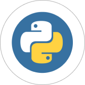
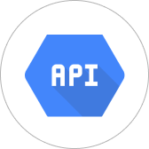

# Привет! Рад приветствовать тебя на своем профиле

 

## Залесов Александр Леонидович

Мне 35 лет, родился 30 ноября 1987 года в г. Архангельске  
В настоящий момент проживаю в Санкт-Петербург, у меня двое детей.

_Мои контакты:_  
**Моб тел:** +7(953)-168-24-81 
**Эл почта:** gooder08@yandex.ru   
[Ссылка на мой телеграм](https://t.me/gooder08)

### Кратко расскажу о своей карьере  

С 2010 года моя карьера складывалась в оновном в банковской сфере (продажи), 
но еще со школьной скамьи я увлекался программированием, поэтому с осени 2022 года  
я прохожу обучение в Нетологии по курсу "Fullstack-разработчик на Python", срок окончания - 2024 год.  
В настоящий момент рассматриваю проекты в сфере IT.

### Ключевые навыки на май 2023 года
1.  Работа с изменениями кода проекта с помощью Git и GitHub
2.  Решение универсальных задач с использованием Python
3.  Работа с базами данных с использованием SQLAlchemy и PostgreSQL
4.  Работа с API сторонних сервисов
5.  Unit-тестирование при помощи PyTest и Unittest
6.  Работа с файлами XML/JSON/YAML/CSV
7.  Система управления проектами Jira
8.  Работа в Linux

### Реализованные проекты:
1. Различные телеграм боты
2. Работа с API vk.com, Qiwi кошелька, сервисами Яндекса, Telegram, Nominatim
3. Парсинг сайтов.

